# Pivotal Cloud Native Tour

<!-- toc -->

- [Pivotal Cloud Native Tour](#pivotal-cloud-native-tour)
- [Lab 1 - Getting Started with Spring Boot](#lab-1-getting-started-with-spring-boot)
	- [Bootstrap the Project](#bootstrap-the-project)
	- [Build and Run with Embedded Apache Tomcat](#build-and-run-with-embedded-apache-tomcat)
	- [Refactor to Externalize the Config](#refactor-to-externalize-the-config)
	- [Using Environment Variables for Config](#using-environment-variables-for-config)
	- [Using Spring Profiles for Config](#using-spring-profiles-for-config)
	- [Resolving Conflicts](#resolving-conflicts)
- [Lab 2 - Introspection, Monitoring, and Metrics using Spring Boot Actuator](#lab-2-introspection-monitoring-and-metrics-using-spring-boot-actuator)
	- [Set up the Actuator](#set-up-the-actuator)
	- [Introspection Endpoints](#introspection-endpoints)
	- [Just read it - Build and Version Control Info](#just-read-it-build-and-version-control-info)
	- [Health Indicators](#health-indicators)
	- [Metrics](#metrics)
- [Lab 3 - Composing Cloud Native Apps with Spring Cloud and Netflix OSS](#lab-3-composing-cloud-native-apps-with-spring-cloud-and-netflix-oss)
	- [Overall architecture](#overall-architecture)
	- [Bootstrapping](#bootstrapping)
	- [Config Server](#config-server)
	- [Eureka Server](#eureka-server)
	- [Fortune Service](#fortune-service)
	- [Fortune UI](#fortune-ui)
	- [Hystrix Dashboard](#hystrix-dashboard)
- [Lab 4 - Push Cloud Native Apps to Pivotal Cloud Foundry](#lab-4-push-cloud-native-apps-to-pivotal-cloud-foundry)
	- [Build and Push!](#build-and-push)

<!-- tocstop -->

For simple getting started guide you may also want to read:
https://spring.io/guides/gs/centralized-configuration/
https://spring.io/guides/gs/service-registration-and-discovery/
https://spring.io/guides/gs/client-side-load-balancing/


# Lab 1 - Getting Started with Spring Boot
## Bootstrap the Project

1. In your browser, visit http://start.spring.io.

2. Fill out the Project metadata fields as follows:

```java
Group
io.pivotal.spring

Artifact
hello-spring-boot
```

3. In the Dependencies section, search for web, and choose **Web** from the autocomplete menu.

4. Click the Generate Project button. Your browser will download a zip file. Unpack that zip file at **$COURSE_HOME/labs/initial.**

5. Import the project’s pom.xml into your editor/IDE of choice.

6. Add a ```@RestController``` annotation to the class ```io.pivotal.spring.HelloSpringBootApplication```.

7. Add the following request handler to the class ```io.pivotal.spring.HelloSpringBootApplication```:


```java
@RequestMapping("/")
public String hello() {
    return "Hello World!";
}
```

## Build and Run with Embedded Apache Tomcat

Spring Boot will embed Apache Tomcat by default.

1. Build the application:

```bash
$ ./mvnw package
```

2. Run the application:

```bash
$ java -jar target/hello-spring-boot-0.0.1-SNAPSHOT.jar
```

You should see the application start up an embedded Apache Tomcat server on port 8080:

```code
2015-12-06 17:17:30.507  INFO 60277 --- [           main] s.b.c.e.t.TomcatEmbeddedServletContainer : Tomcat started on port(s): 8080 (http)
2015-12-06 17:17:30.511  INFO 60277 --- [           main] io.pivotal.spring.HelloSpringBootApplication    : Started HelloSpringBootApplication in 3.201 seconds (JVM running for 3.846)
```

3. Visit the application in the browser (http://localhost:8080), and you should see the following:

```code
Hello World!
```

## Refactor to Externalize the Config

1. Rename src/main/resources/application.properties to src/main/resources/application.yml. Into that file, paste the following:

```yml
greeting: Hello
```

2. To the class io.pivotal.spring.HelloSpringBootApplication, add a greeting field and inject its value:

```java
@Value("${greeting}")
String greeting;
```

3. Also io.pivotal.spring.HelloSpringBootApplication, change the return statement of hello() to the following:

```java
return String.format("%s World!", greeting);
```

4. Build the application:

```bash
$ ./mvnw package
```

5. Run the application:

```bash
$ java -jar target/hello-spring-boot-0.0.1-SNAPSHOT.jar
```

6. Visit the application in the browser (http://localhost:8080), and verify that the output is still the following:

```code
Hello World!
```

7. Stop the application.

## Using Environment Variables for Config

1. Run the application again, this time setting the GREETING environment variable:


```code
$ GREETING=Ohai java -jar target/hello-spring-boot-0.0.1-SNAPSHOT.jar
```
2. Visit the application in the browser (http://localhost:8080), and verify that the output has changed to the following:

```code
Ohai World!
```

3. Stop the application.

## Using Spring Profiles for Config

1. Add a spanish profile to application.yml. Your finished configuration should reflect the following:
```yml
greeting: Hello

---

spring:
  profiles: spanish

greeting: Hola
```

2. Build the application:

```bash
$ ./mvnw package
```

3. Run the application, this time setting the
SPRING_PROFILES_ACTIVE environment variable:

```code
$ SPRING_PROFILES_ACTIVE=spanish java -jar target/hello-spring-boot-0.0.1-SNAPSHOT.jar
```

4. Visit the application in the browser (http://localhost:8080), and verify that the output has changed to the following:

```code
Hola World!
```

5. Stop the application.

## Resolving Conflicts

1. Run the application, this time setting both the SPRING_PROFILES_ACTIVE and GREETING environment variables:

```code
$ SPRING_PROFILES_ACTIVE=spanish GREETING=Ohai java -jar target/hello-spring-boot-0.0.1-SNAPSHOT.jar
```

2. Visit the application in the browser (http://localhost:8080), and verify that the output has changed to the following:

```code
Ohai World!
```

3. Visit http://docs.spring.io/spring-boot/docs/current/reference/html/boot-features-external-config.html to learn more about this outcome and the entire priority scheme for conflict resolution.

# Lab 2 - Introspection, Monitoring, and Metrics using Spring Boot Actuator

## Set up the Actuator

1. Continue with the project you completed in Lab 1.

2. To pom.xml add the following dependency to include the starter for Spring Boot Actuator:

```xml
<dependency>
	<groupId>org.springframework.boot</groupId>
	<artifactId>spring-boot-starter-actuator</artifactId>
</dependency>
```

## Introspection Endpoints

1. Build the application:

```bash
$ ./mvnw package
```

2. Run the application:

```bash
$ java -jar target/hello-spring-boot-0.0.1-SNAPSHOT.jar
```

3. Try out the following endpoints. The output is omitted here because it can be quite large:

http://localhost:8080/beans

* Dumps all of the beans in the Spring context.

http://localhost:8080/autoconfig

* Dumps all of the auto-configuration performed as part of application bootstrapping.

http://localhost:8080/configprops

* Displays a collated list of all @ConfigurationProperties.

http://localhost:8080/env
* Dumps the application’s shell environment as well as all Java system properties.

http://localhost:8080/mappings
* Dumps all URI request mappings and the controller methods to which they are mapped.

http://localhost:8080/dump
* Performs a thread dump.

http://localhost:8080/trace
* Displays trace information (by default the last few HTTP requests).


## Just read it - Build and Version Control Info

Spring Boot provides an endpoint (http://localhost:8080/info) that allows the exposure of arbitrary metadata.

One thing that it does well is expose information about the specific build and version control coordinates for a given deployment.

1. Add the following plugin to your Maven build. It will add Git branch and commit coordinates to the /info endpoint:

```xml
<plugin>
	<groupId>pl.project13.maven</groupId>
	<artifactId>git-commit-id-plugin</artifactId>
	<configuration>
		<dotGitDirectory>../../../.git</dotGitDirectory>
	</configuration>
</plugin>
```

**NOTE**
The path ../../../.git refers to the .git directory at the root of the course materials.

2. Add the following properties to src/main/resources/application.yml:

```yml
info:
  build:
    artifact: @project.artifactId@
    name: @project.name@
    description: @project.description@
    version: @project.version@
```

These will add the project’s Maven coordinates to the /info endpoint. The Spring Boot Maven plugin will cause them to automatically be replaced in the assembled JAR.

3. Build the application:

```bash
$ ./mvnw package
```

4. Run the application:

```bash
$ java -jar target/hello-spring-boot-0.0.1-SNAPSHOT.jar
```

5. Visit the application in the browser (http://localhost:8080/info), and verify that the output is similar to the following:

```yml
{
   "git" : {
      "commit" : {
         "time" : "2015-12-06T17:25:32-0500",
         "id" : "78b0e1b"
      },
      "branch" : "master"
   },
   "build" : {
      "version" : "0.0.1-SNAPSHOT",
      "name" : "hello-spring-boot",
      "artifact" : "hello-spring-boot",
      "description" : "Demo project for Spring Boot"
   }
}
```

## Health Indicators

Spring Boot provides an endpoint (http://localhost:8080/health) that allows for the notion of various health indicators.

1. Normally, when Spring Security is not enabled, the /health endpoint will only expose an UP or DOWN value. To simplify working with the endpoint for this lab, we will turn off its sensitivity. Add the following to src/main/resources/application.yml:

```yml
endpoints:
  health:
    sensitive: false
```

2. Create the class io.pivotal.spring.FlappingHealthIndicator and into it paste the following code:

```java
@Component
public class FlappingHealthIndicator implements HealthIndicator{

    private Random random = new Random(System.currentTimeMillis());

    @Override
    public Health health() {
        int result = random.nextInt(100);
        if (result < 50) {
            return Health.down().withDetail("flapper", "failure").withDetail("random", result).build();
        } else {
            return Health.up().withDetail("flapper", "ok").withDetail("random", result).build();
        }
    }
}
```

This demo health indicator will randomize the health check.

3. Build the application:

```bash
$ ./mvnw package
```

4. Run the application:

```bash
$ java -jar target/hello-spring-boot-0.0.1-SNAPSHOT.jar
```

5. Visit the application in the browser (http://localhost:8080/health), and verify that the output is similar to the following (and changes randomly!):

```json
{
  "status": "UP",
  "flapping": {
    "status": "UP",
    "flapper": "ok",
    "random": 69
  },
  "diskSpace": {
    "status": "UP",
    "free": 113632186368,
    "threshold": 10485760
  }
}
```

## Metrics

Spring Boot provides an endpoint (http://localhost:8080/metrics) that exposes several automatically collected metrics for your application. It also allows for the creation of custom metrics.

1. Create the class io.pivotal.spring.GreetingService and into it paste the following code:

```java
@Component
public class GreetingService {

    @Autowired
    CounterService counterService;

    @Value("${greeting}")
    String greeting;

    public String getGreeting() {
        counterService.increment("counter.services.greeting.invoked");
        return greeting;
    }
}
```

This class is using the @Autowired CounterService to count the number of times that the getGreeting() method has been invoked.

2. Refactor the contents of the class ```io.pivotal.spring.HelloSpringBootApplication```:

```java
@Autowired
private GreetingService greetingService;

@RequestMapping("/")
public String hello() {
    return String.format("%s World!", greetingService.getGreeting());
}

public static void main(String[] args) {
    SpringApplication.run(HelloSpringBootApplication.class, args);
}
```

hello() is now delegating the source of the greeting to our newly created GreetingService.

3. Build the application:

```bash
$ ./mvnw package
```

4. Run the application:

```bash
$ java -jar target/hello-spring-boot-0.0.1-SNAPSHOT.jar
```

5. Visit the application in the browser (http://localhost:8080) and refresh the page several times.

6. Now visit the /metrics endpoint (http://localhost:8080/metrics). Among the autogenerated metrics you should see a counter for the GreetingService invocations:

```yml
counter.services.greeting.invoked: 16,
```

To learn more about the autogenerated metrics, visit http://docs.spring.io/spring-boot/docs/current/reference/html/production-ready-metrics.html.

# Lab 3 - Composing Cloud Native Apps with Spring Cloud and Netflix OSS

In this lab we’re going to build a Fortune Teller application from two microservices, one that serves up random Chinese fortune cookies, and one that presents a user interface. The resulting application looks like the following screenshot:

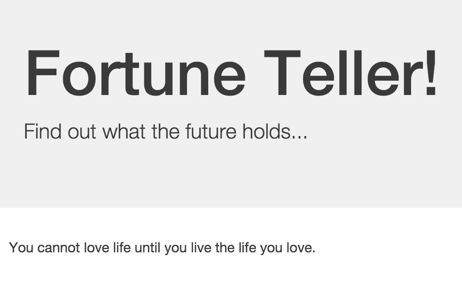


We’ll leverage libraries and services from Spring Cloud and Netflix OSS to help us compose the system.

## Overall architecture

The project will use the following
- Spring Cloud Config Server, http://localhost:8888
- fortune-ui, http://localhost:8081
- Eureka Registry Service, http://localhost:8761/eureka
- fortune-service (possibly multiple), http://localhost:8080, http://localhost:8090
- Hystrix Dashboard, http://localhost:7979


## Bootstrapping

1. Choose File → Import:

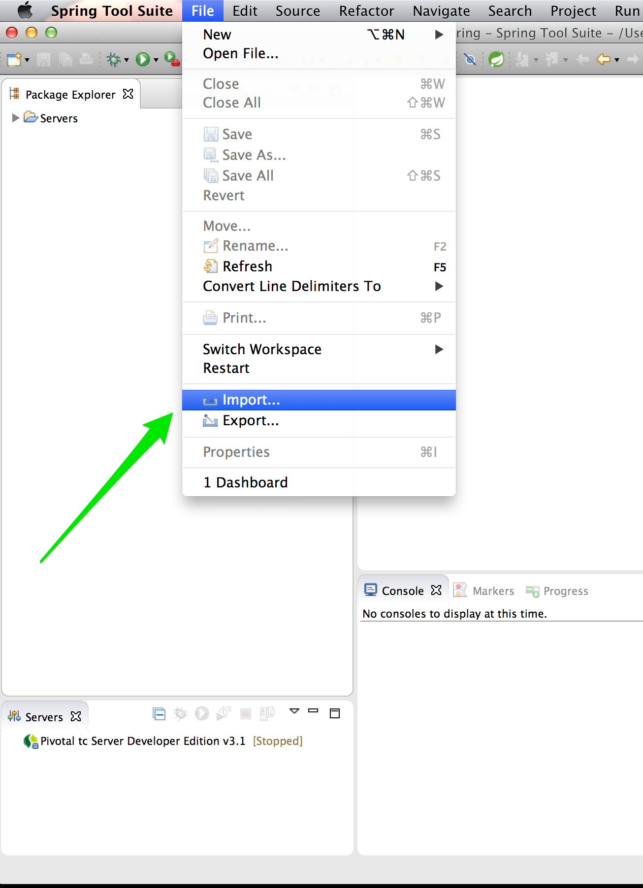

2. Choose Maven → Existing Maven Projects:

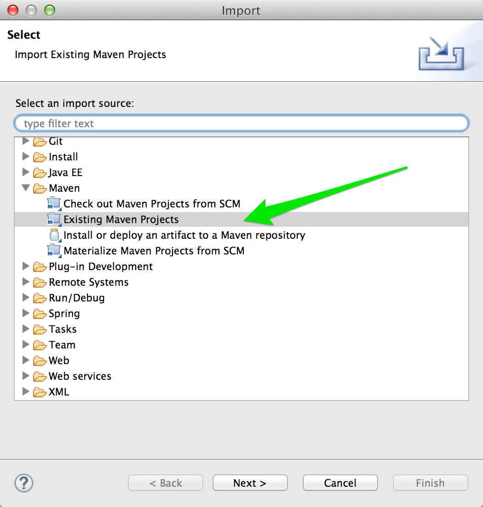

3. Choose the project’s pom.xml, found at $COURSE_HOME/labs/initial/fortune-teller and click Finish.

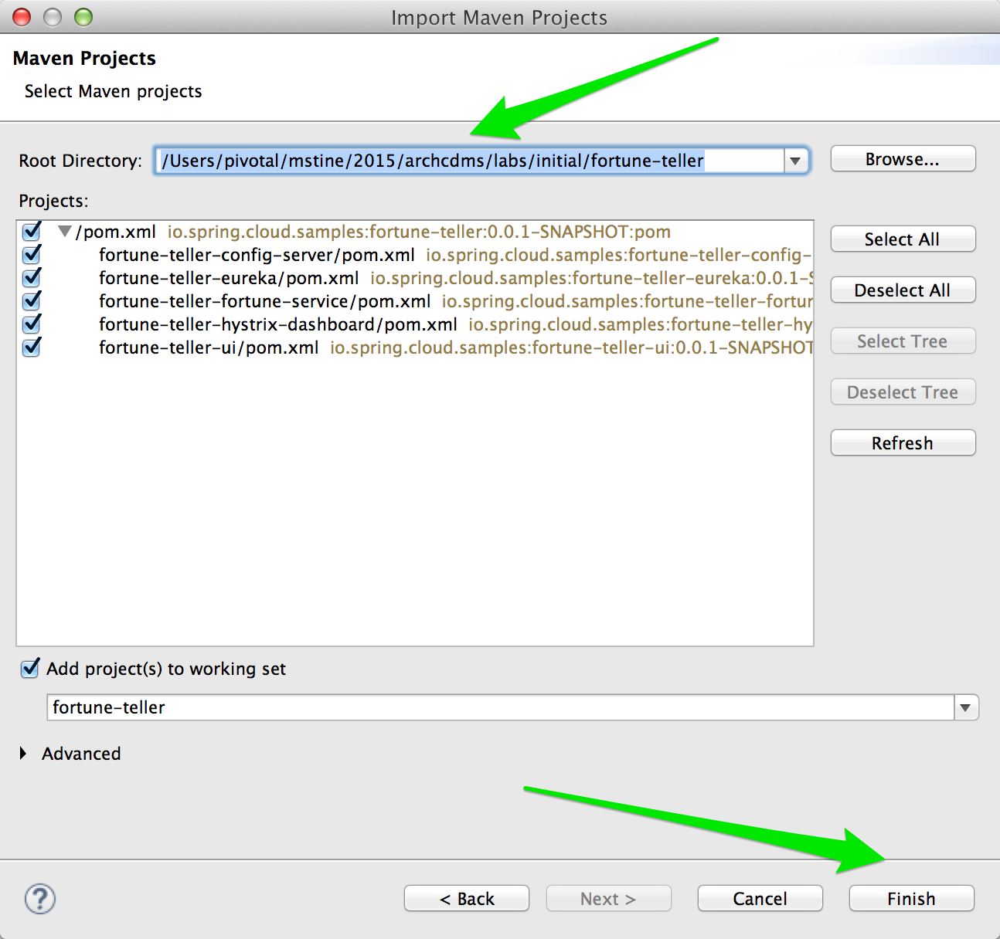

## Config Server

First we’ll create a Spring Cloud Config Server to distribute shared configuration across our distributed system. This configuration will form the basis of how the entire system will compose.

1. In the fortune-teller-config-server module, add a ```@EnableConfigServer``` annotation to the class ```io.spring.cloud.samples.fortuneteller.configserver.Application```.

2. Paste the following configuration properties into the file src/main/resources/application.yml:

```yml
server:
  port: 8888

spring:
  cloud:
    config:
      server:
        git:
          uri: https://github.com/ebornier-pivotal/CloudNativeTour-config.git
```

These properties tell the Config Server to listen on port 8888 and to source its configuration from the Git repository found at https://github.com/ebornier-pivotal/CloudNativeTour-config.git
(you can also use https://github.com/mstine/config-repo ).

3. Browse the file
https://github.com/ebornier-pivotal/CloudNativeTour-config/blob/master/application.yml
These lines tell all applications using the cloud Spring profile how to connect to and register themselves with Eureka.
```yml
eureka:
  ...
  client:
    serviceUrl:
      defaultZone: ${vcap.services.service-registry.credentials.uri:http://127.0.0.1:8761}/eureka/

```
`This is very important !` The config server will be shared by all the microservices, and as they read from it, they will find their Eureka target URL.
You can see a default value of http://localhost:8761/eureka/ and otherwise a lookup in the environment for `vcap.services.service-registry.credentials.uri` which will resolve when running later on Cloud Foundry using the `service-registry` as the name for the Eureka Service Registry service name.

The microservices such as *fortune-ui* will lookup that config server using a `bootstrap.yml` early in their startup sequence (before `application.yml`) as in
```yml
spring:
  application:
    name: ui
  cloud:
    config:
      uri: ${vcap.services.config-service.credentials.uri:http://localhost:8888}
```

You can see a default value of http://localhost:8888 and otherwise a lookup in the environment for `vcap.services.config-service.credentials.uri` which will resolve when running later on Cloud Foundry using the `config-service` as the name for the Config Server service name.

4. In the Boot Dashboard, right click on fortune-teller-config-server and choose (Re)start:

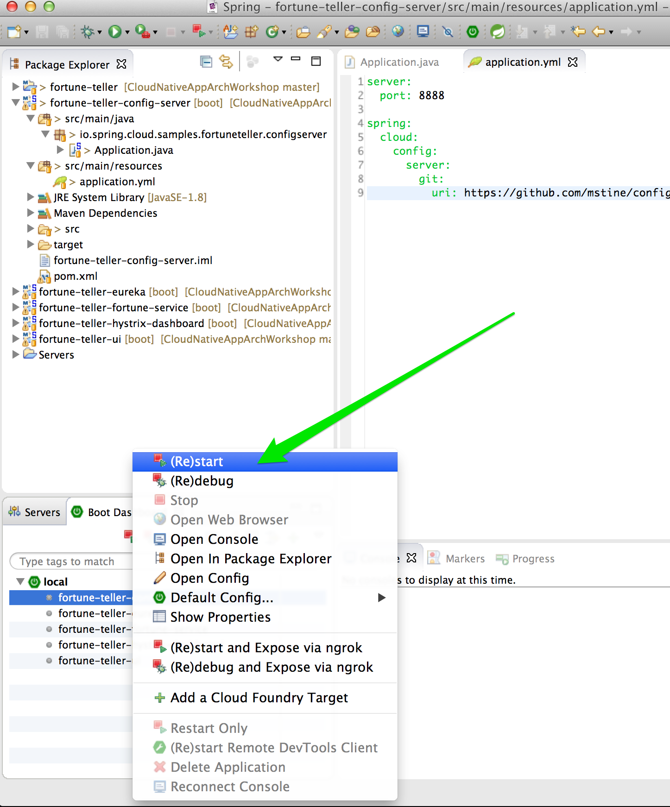

5. Browse to http://localhost:8888/application/default. You should see output similar to the following:

config server output

6. Note that the response JSON defines a Spring PropertySource that contains Eureka configuration consistent with what you saw in the Git repository.

To validate the config server, you can access */ui/default/* (http://localhost:8888/ui/default) which is the URL that the config server client would call to retrieve the configuration for a an application name `ui` and using a `default` Spring profile, and accessing the `master` branch of the config.
Read more at http://cloud.spring.io/spring-cloud-static/spring-cloud.html#_quick_start

```bash
curl -X GET http://localhost:8888/ui/default
```

## Eureka Server

Next we’ll create a Eureka service registry using Spring Cloud Netflix. This server will act as the address book our UI application will use to locate the Fortune Service.

1. In the fortune-teller-eureka module, add a ```@EnableEurekaServer``` annotation to the class
```io.spring.cloud.samples.fortuneteller.eureka.Application```.

2. Paste the following configuration properties into the file src/main/resources/application.yml:

```yml
server:
  port: 8761

eureka:
  instance:
    hostname: localhost
  client:
    registerWithEureka: false
    fetchRegistry: false
    serviceUrl:
      defaultZone: http://${eureka.instance.hostname}:${server.port}/eureka/
```

These properties tell the Eureka Server to listen on port 8761 and to configure itself in what is essentially "standalone" mode.

3. As before, in the Boot Dashboard, right click on fortune-teller-eureka and choose (Re)start.

4. Browse to http://localhost:8761. You should see a UI similar to the following:

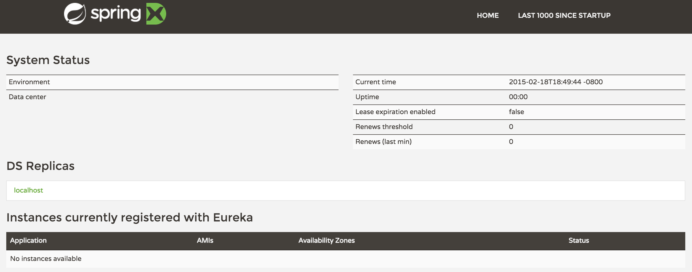

eureka 1

## Fortune Service

Now that our Spring Cloud/Netflix OSS infrastructure is bootstrapped, we’ll begin development of our first microservice. The Fortune Service will serve up a list of all fortune cookies present in its database or a single random fortune.

1. In the fortune-teller-fortune-service module, create the package `io.spring.cloud.samples.fortuneteller.fortuneservice.domain`.

2. Create a JPA domain class, `io.spring.cloud.samples.fortuneteller.fortuneservice.domain.Fortune`. Into that class, paste the following code:

```java
		@Entity
		@Table(name = "fortunes")
		public class Fortune {

		    @Id
		    @GeneratedValue
		    private Long id;

		    @Column(nullable = false)
		    private String text;

		    public Long getId() {
		        return id;
		    }

		    public void setId(Long id) {
		        this.id = id;
		    }

		    public String getText() {
		        return text;
		    }

		    public void setText(String text) {
		        this.text = text;
		    }
		}
```

Add the appropriate imports using the IDE’s quick fix feature.

This class represents the domain model for a fortune, having an unique identifier and the fortune’s text.

3. Next, create the package ```io.spring.cloud.samples.fortuneteller.fortuneservice.repositories```.

4. Create a Spring Data JPA repository interface, io.spring.cloud.samples.fortuneteller.fortuneservice.repositories.FortuneRepository. Into that class, paste the following code:

```java
public interface FortuneRepository extends PagingAndSortingRepository<Fortune, Long> {

    @Query("select fortune from Fortune fortune order by RAND()")
    public List<Fortune> randomFortunes(Pageable pageable);
}
```

5. Add the appropriate imports using the IDE’s quick fix feature.

This interface will provide all of the basic boilerplate CRUD features we’ll want for our Fortune domain class. The @Query annotation defines a SQL statement that will return a random ordering of the fortunes. We’ll use this as the basis of returning a random fortune via our REST interface.

6. Next, create the package io.spring.cloud.samples.fortuneteller.fortuneservice.controllers.

7. Create a Spring MVC Controller class, io.spring.cloud.samples.fortuneteller.fortuneservice.controllers.FortuneController. Into that class, paste the following code:

```java
@RestController
public class FortuneController {

    @Autowired
    FortuneRepository repository;

    @RequestMapping("/fortunes")
    public Iterable<Fortune> fortunes() {
        return repository.findAll();
    }

    @RequestMapping("/random")
    public Fortune randomFortune() {
        List<Fortune> randomFortunes = repository.randomFortunes(new PageRequest(0, 1));
        return randomFortunes.get(0);
    }
}
```

Add the appropriate imports using the IDE’s quick fix feature.

This class provides the two REST endpoints of our microservice. The randomFortune method provides a PageRequest to limit the returned results to one.

8. Add `@EnableJpaRepositories` (to enable the Spring Data JPA repository we created) and `@EnableDiscoveryClient` (to switch on Eureka registration) annotations to io.spring.cloud.samples.fortuneteller.fortuneservice.Application.

Paste the following configuration properties into the file src/main/resources/bootstrap.yml:

```yml
spring:
  application:
    name: fortune
  cloud:
    config:
      uri: ${vcap.services.config-service.credentials.uri:http://localhost:8888}
```

This configuration specifies the name of the application, which will be used to register the service in Eureka. It also tells the service how to locate the config server.

9. Paste the following configuration properties into the file src/main/resources/application.yml:

```yml
spring:
  jpa:
    hibernate:
      ddl-auto: create-drop

---

spring:
  profiles: default
  jpa:
    database: HSQL

---

spring:
  profiles: cloud
  jpa:
    database: POSTGRESQL
```

This configuration specifies the model to DDL setting to be used by Hibernate, as well as the Hibernate dialects to be used for local development and cloud profile.

10. As before, in the Boot Dashboard, right click on fortune-teller-fortune-service and choose (Re)start.

After the service has been running for ten seconds, refresh your Eureka browser tab. You should see a registration entry for the fortune service.

11. Visit http://localhost:8080/random. You should see output similar to the following:

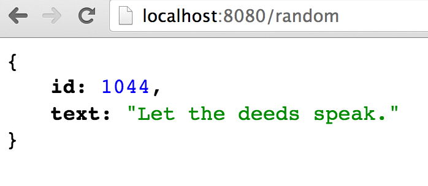

You can also start multiple such application instances:
```bash
java -Dserver.port=8090 target/fortune-teller-fortune-service-0.0.1-SNAPSHOT.jar
```
and observe Eureka and service load balancing later thru Ribbon RestTemplate.

## Fortune UI
Now that our Fortune microservice is running, we’ll begin development of our second microservice. The Fortune UI will serve up a AngularJS single page application that consumes the fortune service.

1. In the fortune-teller-ui module, create the package `io.spring.cloud.samples.fortuneteller.ui.services.fortunes`. This package will contain our integration with the fortune service.

2. Create the POJO io.spring.cloud.samples.fortuneteller.ui.services.fortunes.Fortune. Into that class, paste the following code:

```java
public class Fortune {
    private Long id;
    private String text;

    public Fortune() {
    }

    public Fortune(Long id, String text) {
        this.id = id;
        this.text = text;
    }

    public Long getId() {
        return id;
    }

    public void setId(Long id) {
        this.id = id;
    }

    public String getText() {
        return text;
    }

    public void setText(String text) {
        this.text = text;
    }
}
```

We will use this class to unmarshal the response from the fortune service.

3. Create the Spring Bean

```io.spring.cloud.samples.fortuneteller.ui.services.fortunes.FortuneService```.

 Into that class, paste the following code:

```java
@Service
public class FortuneService {

		// In Spring Cloud Brixton release and after, a RestTemplate is not auto injected
		@Bean
		@LoadBalanced
		public RestTemplate restTemplate() {
	  	return new RestTemplate();
		}

    @Autowired
    RestTemplate restTemplate;

    @HystrixCommand(fallbackMethod = "fallbackFortune")
    public Fortune randomFortune() {
        return restTemplate.getForObject("http://fortune/random", Fortune.class);
    }

    private Fortune fallbackFortune() {
        return new Fortune(42L, "Your future is unclear.");
    }
}
```

Add the appropriate imports using the IDE’s quick fix feature.

This class is our integration point with the fortune service. It uses a **special RestTemplate bean that integrates with Ribbon from Netflix OSS**. The argument passed to getForObject, http://fortune/random, will be resolved by Ribbon to the actual address of the fortune service. This method is also protected by a **Hystrix circuit breaker** using the `@HystrixCommand` annotation. If the circuit is tripped to open (due to an unhealthy fortune service), the fallbackFortune method will return a dummy response.

4. Next, create the package ```io.spring.cloud.samples.fortuneteller.ui.controllers```.

5. Create a Spring MVC Controller class, ```io.spring.cloud.samples.fortuneteller.ui.controllers.UiController```.

Into that class, paste the following code:

```java
@RestController
public class UiController {

    @Autowired
    FortuneService service;

    @RequestMapping("/random")
    public Fortune randomFortune() {
        return service.randomFortune();
    }
}
```

6. Add the appropriate imports using the IDE’s quick fix feature.

This class provides the REST endpoint that will be consumed by our AngularJS UI.

7. Add `@EnableCircuitBreaker` (to switch on Hystrix circuit breakers) and `@EnableDiscoveryClient` (to switch on Eureka registration) annotations to io.spring.cloud.samples.fortuneteller.ui.Application.

8. Paste the following configuration properties into the file src/main/resources/bootstrap.yml:

```yml
spring:
  application:
    name: ui
  cloud:
    config:
      uri: ${vcap.services.config-service.credentials.uri:http://localhost:8888}
```

This configuration specifies the name of the application, which will be used to register the service in Eureka. It also tells the service how to locate the config server.

9. Paste the following configuration properties into the file src/main/resources/application.yml:

```yml
server:
  port: 8081

eureka:
  client:
    registryFetchIntervalSeconds: 5

fortune:
  ribbon:
    ServerListRefreshInterval: 5000
```

This configuration instructs the application to listen on port 8081. It also provides low cache refresh settings for the Eureka client and Ribbon to make the demo more responsive.

10. As before, in the Boot Dashboard, right click on fortune-teller-ui and choose (Re)start.

After the service has been running for ten seconds, refresh your Eureka browser tab. You should see a registration entry for the Fortune UI.

11. Visit http://localhost:8081. You should see output similar to the following:


## Hystrix Dashboard

Finally, we’ll add one more piece of infrastructure — a dashboard that allows us to monitor our circuit breakers — using Spring Cloud Netflix.

1. In the fortune-teller-hystrix-dashboard module, add `@EnableHystrixDashboard` and `@Controller` annotations to the class io.spring.cloud.samples.fortuneteller.hystrixdashboard.Application.

2. Add the following request handler method to io.spring.cloud.samples.fortuneteller.hystrixdashboard.Application:

```java
@RequestMapping("/")
public String home() {
    return "forward:/hystrix";
}
```

3. Add the appropriate imports using the IDE’s quick fix feature.

This request handler will allow us to hit the default endpoint our application to interact with the Hystrix Dashboard.

4. Paste the following configuration properties into the file src/main/resources/application.yml:

```yml
server:
  port: 7979
```

This configuration instructs the application to listen on port 7979.

5. As before, in the Boot Dashboard, right click on fortune-teller-hystrix-dashboard and choose (Re)start.

6. Visit http://localhost:7979. You should see output similar to the following:

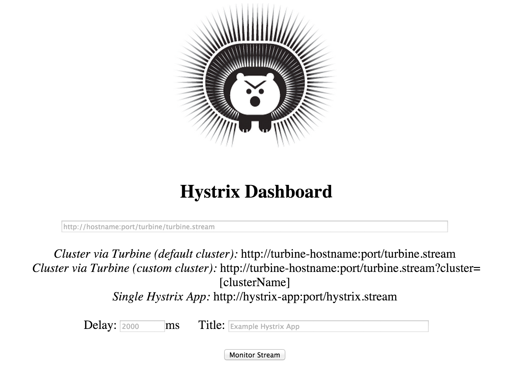

7. Paste http://localhost:8081/hystrix.stream into the text field and click Monitor Stream. This is a single Hystrix stream that work as our fortune-ui is single instance - but you would need a Turbine cluster backed by a messsaging like RabbitMQ for a production grade stream.
You should see output similar to the following:

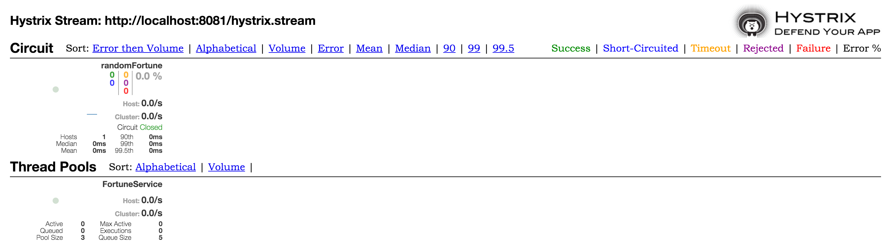


# Lab 4 - Push Cloud Native Apps to Pivotal Cloud Foundry

## Build and Push!

1. Return to the Fortune Teller application directory that you finished in Lab 3:

```bash
$ cd $COURSE_HOME/labs/initial/fortune-teller
```

2. Using Maven, build and package the application:

```bash
$ mvn package
```
Maven will automatically download all of Fortune Teller dependencies. This may take a few moments.

3. Push the Spring Cloud services:

```bash
$ cf push -f manifest-services.yml
```

This will push the Spring Cloud Config Server, a Eureka server, and a Hystrix Dashboard, all with random routes.

4. Edit scripts/create_services.sh to add the random routes that were generated for you:

```bash
cf cups config-service -p '{"uri":"http://config-server-fluxional-suttee.cfapps.io"}'
cf cups service-registry -p '{"uri":"http://eureka-unprevalent-toper.cfapps.io"}'
cf cs elephantsql turtle fortune-db
```

5. Run scripts/create-services.sh to create the services that you need:

```bash
$ scripts/create_services.sh
```
```bash
Creating user provided service config-service in org platform-eng / space nfjs-workshop as mstine@pivotal.io...
OK
Creating user provided service service-registry in org platform-eng / space nfjs-workshop as mstine@pivotal.io...
OK
Creating service fortune-db in org platform-eng / space nfjs-workshop as mstine@pivotal.io...
OK
```

6. Push the microservices:

```bash
$ cf push -f manifest-apps.yml
```

This will push the fortune service and the ui application.

7. In a browser, access the fortune-ui application at the route that was created for you:

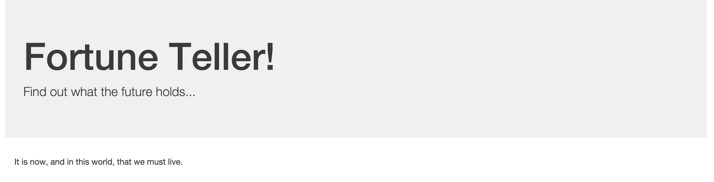

8. Now, in another browser tab, access the Hystrix Dashboard at the route that was created for you. Enter the route for the UI application with /hystrix.stream and click the “Monitor Stream.”

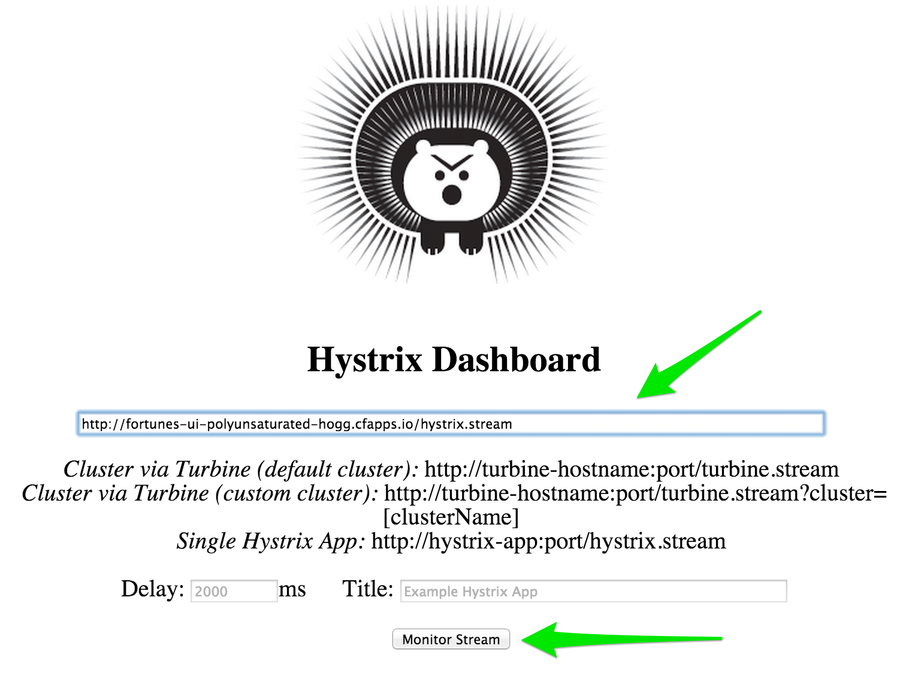

9. Access the fortune-ui and show that the circuit breaker is registering successful requests.

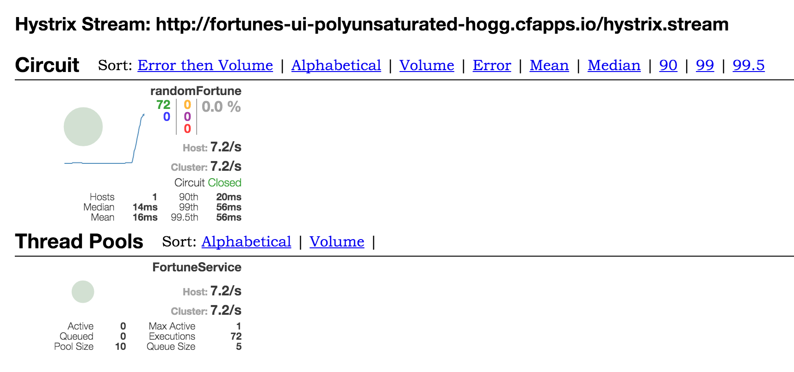

10. Stop the fortune application:

```bash
$ cf stop fortune
```

11. Access the fortune-ui and see that the “fallback fortune” is being returned.


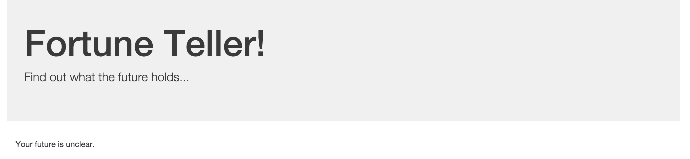

12. Access the fortune-ui and show that the circuit breaker is registering short-circuited requests.

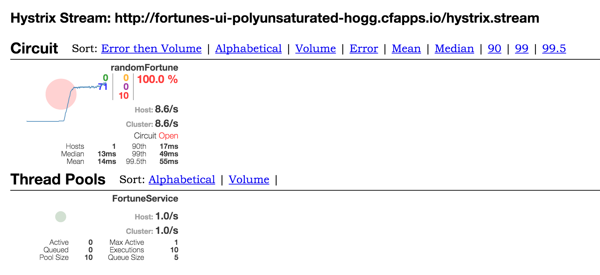

13. Start the fortune application:

```bash
$ cf start fortune
```

Continue to access the fortune-ui and watch the dashboard. After the fortune service has re-registered with Eureka and the fortune-ui load balancer caches are refreshed, you will see the circuit breaker recover. You should then start getting random fortune again!

You can also scale the fortune service and explore your Eureka, as well as stop or crash some of it to observe Ribbon load balancing and Circuit breaker behavior combined with Cloud Foundry.
